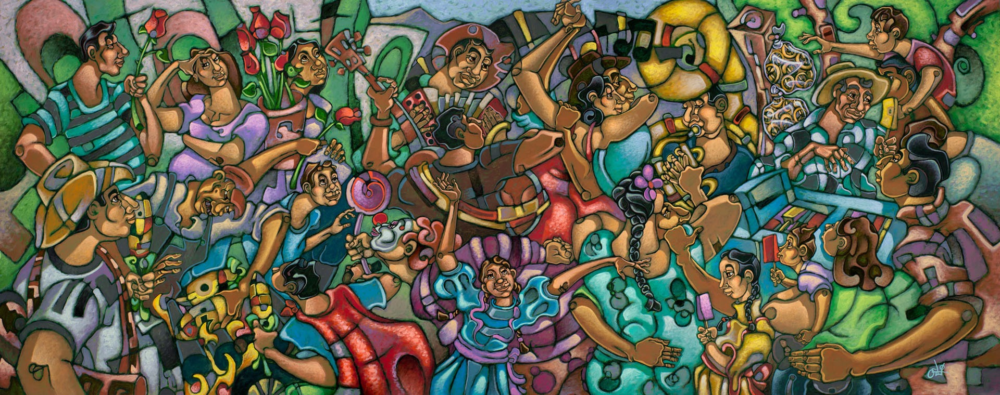

# Hi there! 👋 My name's Victoria (she/her) 💌

# 💟 About Me! 💟

I'm a first-generation Mexican-American 🇲🇽 and first-generation college student 📚 currently attending Cal State University, Fullerton.🐘📍 I am driven by love for learning! 🤓 My goal is to become the first engineer in my family, bridge connections, learn new skills, and give back to my community. 🫂
   
# 📝 Skills 📝

# 🔗 Connect with Me! 🔗

    <a href="https://www.linkedin.com/in/victoria-uriostegui-3a031a26a">
        
